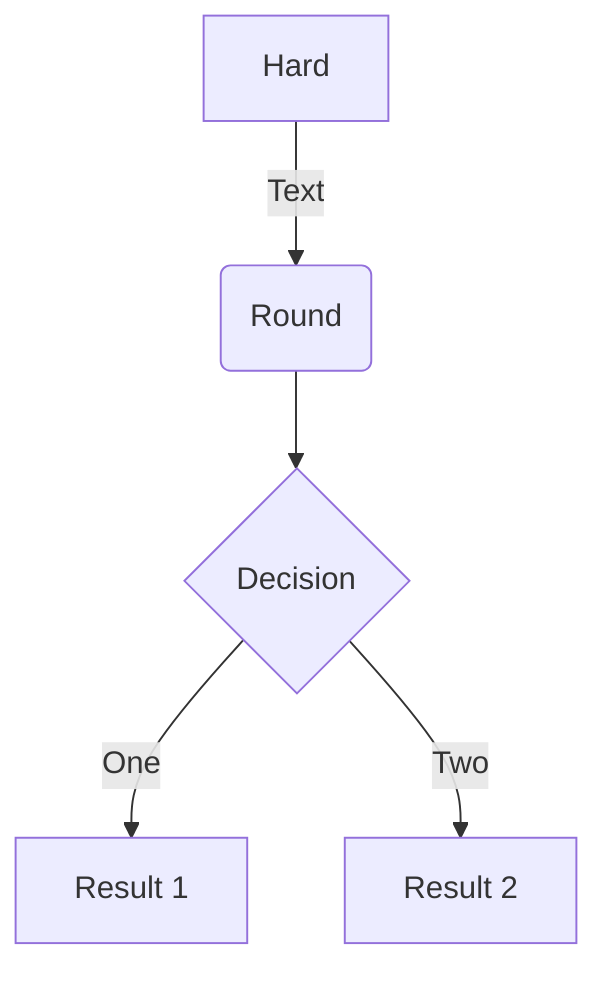
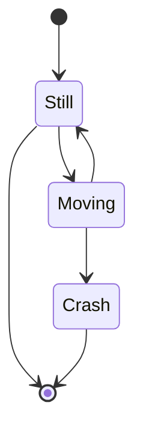
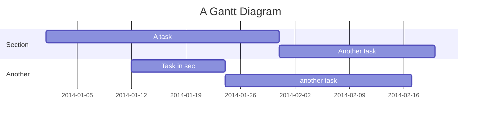
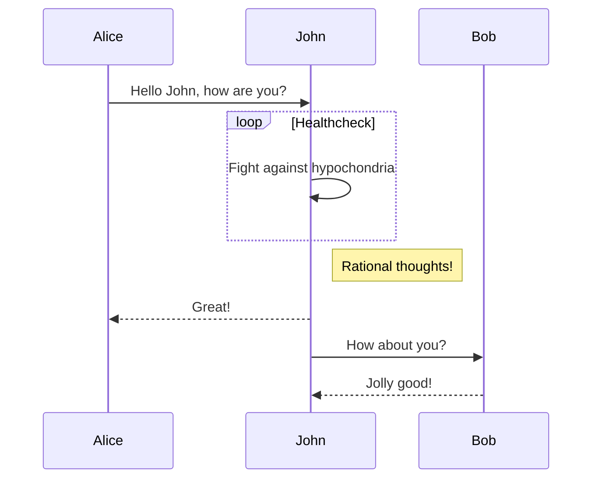
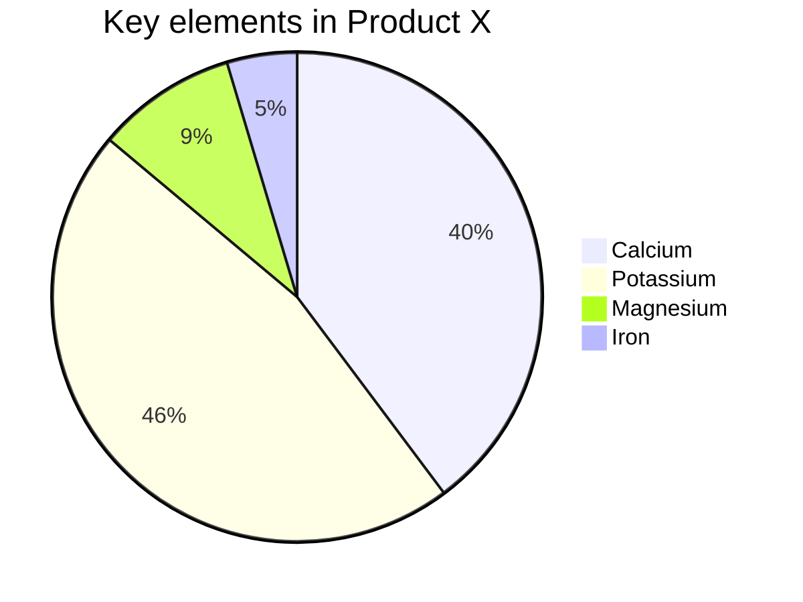

## Enabling Mermaid

Mermaid is an engine that enables you to draw beautiful, highly detailed SVG diagrams and flowcharts 
using Markdown. It is supported out of the box on developer documentation portal.

Some examples of Mermaid diagrams can be found [below](#examples). For usage instructions
and the full range of supported diagrams,
visit [https://mermaid-js.github.io/mermaid](https://mermaid-js.github.io/mermaid).

To view Mermaid diagrams on your local Docsify server, import Mermaid
and edit your Docsify
configuration in your `index.html` file as shown below:

```html
<body>

  <!-- 1. Import mermaid.js, BEFORE the window.$docsify initialisation -->
  <script src="//cdn.jsdelivr.net/npm/mermaid/dist/mermaid.min.js"></script>
  
  <script>
    // 2. Add the two lines below before declaring the window.$docsify object:
    var num = 0;
    mermaid.initialize({ startOnLoad: false });

    // 3. Add the "markdown" option to window.$docsify in addition to the other config
    window.$docsify = {
      ...otherDocsifyConfig,
      markdown: {
        renderer: {
          code: function (code, lang) {
            if (lang === "mermaid") {
              return (
                '<div class="mermaid">' +
                mermaid.render("mermaid-svg-" + num++, code) +
                "</div>"
              );
            }
            return this.origin.code.apply(this, arguments);
          },
        },
      },
    };
  </script>
  <!-- ...other imports -->
</body>
```

## Writing diagrams

To write a Mermaid diagram, simply use a code block with the language type set to `mermaid`:

``````

``````

Renders

```mermaid
flowchart TD
   subgraph "TEST.gitlab-ci.yml"
   s1[lint-job] --- s2[depcheck-job]
   s2 --- s3[unit-test-job]
   end   subgraph "BUILD.gitlab-ci.yml"
   b1[build-job] -.- a3["Update TEST.gitlab-ci.yml"] --&gt; s1
   end   subgraph "DEPLOY.gitlab-ci.yml"
   d1[deploy-testing-job]
   d3[deploy-final-job]
   end   subgraph ".gitlab-ci.yml"
   d1 --> d2[wait-for-webapp-ready-job]
   r1[e2e-test-job] --> r2[e2e-report-job]
   p1[publish-app-job] --> p2[pull-deploy-artefact]
   end   subgraph "Webapp-Compliance"
     subgraph "Static-test"
     s3 -.-> j4[ship-fortify-sast-fod-with-report*]
     j4 --- j5[ship-nexus-iq-scan*]
     j5 --- j6[ship-sonarqube-scan*]
     end
     subgraph "Sign"
     j9[sign-artefact-job]
     end
     subgraph ".pre"
     j1[secret_detection] --- j2["dependency_scanning* (if any)"]
     j2 --- j3["sast* (if any)"]
     j3 -.- a2["Update BUILD.gitlab-ci.yml"] -.-> b1     end
     subgraph "Runtime-test"
     d2 -.-> j7[dast*]
     j7 --- j8[ship-fortify-dast*]
     j8 -.-> r1
     end     subgraph "Deploy-to-prod"
     p2 -.-> j10[verify-job]
     j10 --- j11[verify-artefact-signature]
     j11 --- j12[scan-verified-job*]
     j12 -.-> d3
     end
   end   subgraph "DEPLOY.gitlab-ci.yml"
   j6 -.- a4["Update DEPLOY.gitlab-ci.yml"] -.-> d1
   end   subgraph ".gitlab-ci.yml"
   r2 -.-> j9
   j9 -.-> p1
   end   n1([start]) --- a1["Update variables in .gitlab-ci.yml and project's CICD settings"] --> j1
   d3 --> n2([end])   classDef default fill:#ffd,stroke:#cc7;
   classDef A fill:#ddd,stroke:#eee;
   class a1,a2,a3,a4 A;
   classDef F fill:#fff,stroke:#226;
   class .gitlab-ci.yml,BUILD.gitlab-ci.yml,TEST.gitlab-ci.yml,DEPLOY.gitlab-ci.yml F;
   classDef C fill:#fff,stroke:#226,stroke-dasharray: 5 5;
   class Webapp-Compliance,.pre,Static-test,Runtime-test,Sign,Deploy-to-prod C;
   classDef N fill:#eef,stroke:#226;
   class n1,n2 N;flowchart LR
 subgraph "Legend"
 direction LR
 n1(start) --- a1["user's task"] ---&gt; j1
 j1 -...-> j2
 j3 --> n2(end)
   subgraph "Compliance-Framework"
     subgraph "Stage"
     j2[optional-job*] --> j3[job]
     end
   end
   subgraph "File"
   direction LR
   j1[job]
   end
 end   classDef J fill:#ffd,stroke:#cc7;
   class j1,j2,j3 J;
   classDef A fill:#ddd,stroke:#eee;
   class a1 A;
   classDef F fill:#fff,stroke:#226;
   class File,Legend F;
   classDef C fill:#fff,stroke:#226,stroke-dasharray: 5 5;
   class Compliance-Framework,Stage C;
   classDef N fill:#eef,stroke:#226;
   class n1,n2 N;
```

## Examples

### Flowcharts

```
graph TD
A[Hard] -->|Text| B(Round)
B --> C{Decision}
C -->|One| D[Result 1]
C -->|Two| E[Result 2]
```



### State Diagrams

```
stateDiagram
    [*] --> Still
    Still --> [*]

    Still --> Moving
    Moving --> Still
    Moving --> Crash
    Crash --> [*]
```



### Gantt Charts

```
gantt
    title A Gantt Diagram
    dateFormat  YYYY-MM-DD
    section Section
    A task           :a1, 2014-01-01, 30d
    Another task     :after a1  , 20d
    section Another
    Task in sec      :2014-01-12  , 12d
    another task      : 24d
```



### Sequence Diagrams

```
sequenceDiagram
Alice->>John: Hello John, how are you?
loop Healthcheck
    John->>John: Fight against hypochondria
end
Note right of John: Rational thoughts!
John-->>Alice: Great!
John->>Bob: How about you?
Bob-->>John: Jolly good!
```



### Pie Charts

```
pie
    title Key elements in Product X
    "Calcium" : 42.96
    "Potassium" : 50.05
    "Magnesium" : 10.01
    "Iron" :  5
```


