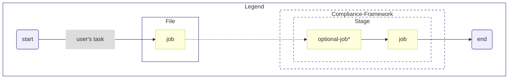

## Enabling Mermaid Alpha Two

Mermaid is an engine that enables you to draw beautiful, highly detailed SVG diagrams and flowcharts
using Markdown. It is supported out of the box on developer documentation portal.

Some examples of Mermaid diagrams can be found [below](#examples). For usage instructions
and the full range of supported diagrams,
visit [https://mermaid-js.github.io/mermaid](https://mermaid-js.github.io/mermaid).

To view Mermaid diagrams on your local Docsify server, import Mermaid
and edit your Docsify
configuration in your `index.html` file as shown below:

```html
<body>
	<!-- 1. Import mermaid.js, BEFORE the window.$docsify initialisation -->
	<script src="//cdn.jsdelivr.net/npm/mermaid/dist/mermaid.min.js"></script>

	<script>
		// 2. Add the two lines below before declaring the window.$docsify object:
		var num = 0;
		mermaid.initialize({ startOnLoad: false });

		// 3. Add the "markdown" option to window.$docsify in addition to the other config
		window.$docsify = {
			...otherDocsifyConfig,
			markdown: {
				renderer: {
					code: function (code, lang) {
						if (lang === "mermaid") {
							return (
								'<div class="mermaid">' +
								mermaid.render("mermaid-svg-" + num++, code) +
								"</div>"
							);
						}
						return this.origin.code.apply(this, arguments);
					},
				},
			},
		};
	</script>
	<!-- ...other imports -->
</body>
```

## Writing diagrams

To write a Mermaid diagram, simply use a code block with the language type set to `mermaid`:

````

````

Example 2


